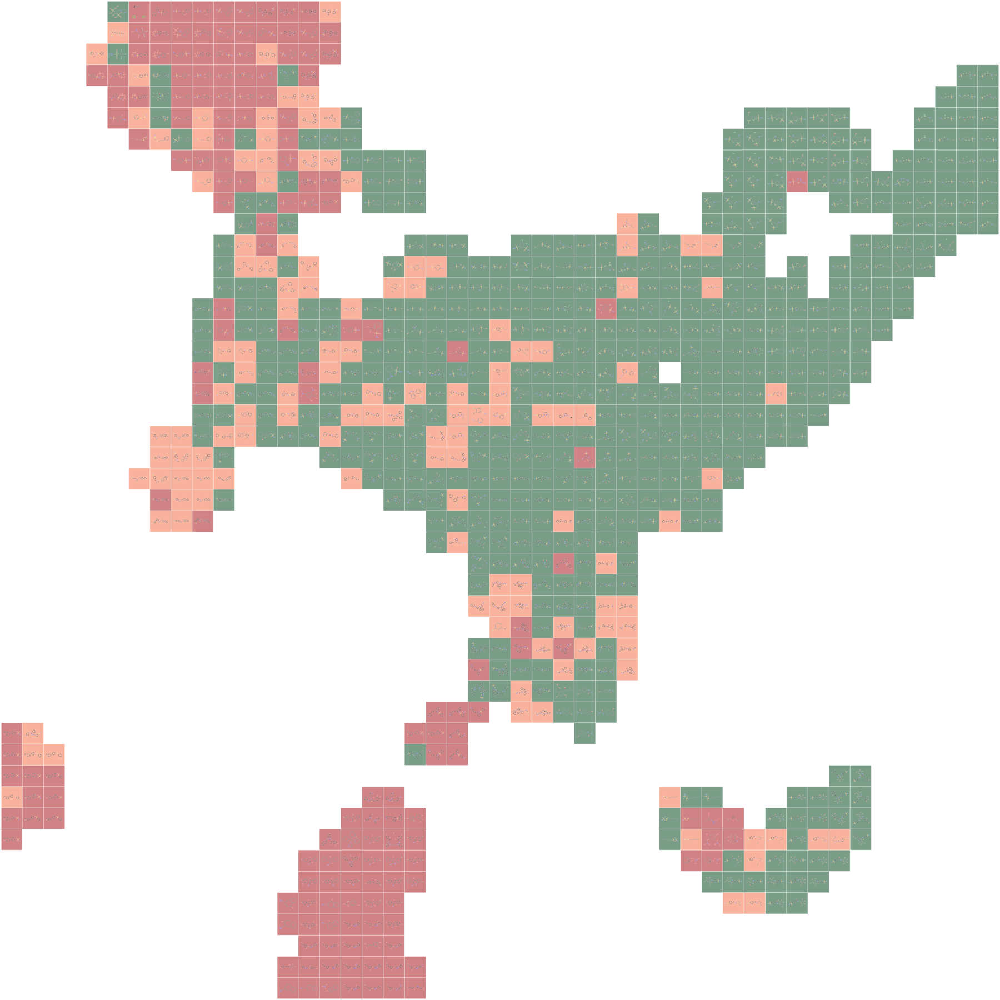

# ChemGridMap

[](https://github.com/Quinnball/ChemGridMap/actions/workflows/tests.yml)
[](LICENSE)
[](https://www.python.org/)

ChemGridMap turns a ChEMBL activity export into an inspectable
one-molecule-per-cell chemical map. A single command can validate the downloaded
records, aggregate repeated measurements to molecule-level median pChEMBL
values, calculate a molecular representation and two-dimensional projection,
assign every molecule to a unique grid cell, and export the final map.

The same program also accepts already curated molecule tables, external learned
embedding columns, and existing two-dimensional coordinates. Representation,
projection, curation reports, and final grid coordinates remain separate in the
outputs so that the transformation can be audited.

ChemGridMap implements and extends the established molecular-grid-map concept;
it does not claim the regular-grid layout or linear-assignment method as new.
Its contribution is the open, auditable ChEMBL-to-map workflow and explicit
projection-to-grid validation. See Yoshimori, Tanoue, and Bajorath,
https://doi.org/10.1021/acsomega.9b00595.



## Installation

Version 0.3.0 adds source-record inspection, parent-structure handling, and
adaptive sparse matching, with a local browser interface using the same core.
Archived analyses record the version actually used;
later interface fixes do not overwrite their original manifests.

The 0.3.0 candidate is not yet published. Until its tag and release are available,
use the supplied source archive and the local installation instructions below.
After publication, create a clean environment and install the tagged package:

```bash
conda create -n chemgridmap -c conda-forge python=3.11 rdkit
conda activate chemgridmap
pip install "chemgridmap[umap] @ git+https://github.com/Quinnball/ChemGridMap.git@v0.3.0"
```

### Local application

The desktop candidate includes Python, RDKit and UMAP; no separate Python
installation is needed. Use an archive built for your operating system and
processor. Extract the archive, then open `ChemGridMap.app` on macOS,
`ChemGridMap.exe` on Windows, or `ChemGridMap` on Linux. The app opens in your
default browser. This is a local application, not a hosted upload service.
The current macOS candidate is ad-hoc signed, not Apple-notarized. It may require
explicit approval in macOS Privacy & Security after you verify its source.
Do not disable system-wide security protections.

1. **Import data:** drop a CSV, browse files, or select **Try a real ChEMBL dataset**.
2. **Configure map:** review the target and endpoint, select a projection, and
   choose **Generate map**. Activity thresholds and identity policies are under
   **Advanced settings**.
3. **Explore & export:** switch between grid and projection views. Click a cell
   or find its ChEMBL ID to open the molecule inspector. **Data audit** contains
   exclusions and diagnostics; **Export** contains figures, tables and the full ZIP.

The English interface uses three separate steps rather than exposing every
setting at once. The welcome-page preview is a real CHEMBL205 Morgan/UMAP grid,
not the output of the current session; its molecule inset is CHEMBL20. Detailed
source records and the local grid neighborhood open only when requested.

Files stay on your computer. The server binds only to `127.0.0.1`, has no
telemetry and does not upload molecular data. Runs are saved under
`~/ChemGridMap/runs` with the original CSV, parameters, provenance and outputs.
Use **Quit** to stop the local server; simply closing the browser tab does not
stop it. Refreshing a tab restores the active session; restarting the application
starts a new session but does not remove saved runs.

The built-in ChEMBL 37 / CHEMBL205 IC50 example contains 2,281 public raw
records. The default policy retains 1,100 records and maps 889 molecules.
Searching `CHEMBL20` retrieves 54 source records and a median pChEMBL of 7.185.
Its conflict flag remains visible. The nearby 3 x 3 cells are a **grid
neighborhood**, not a guarantee of the exact high-dimensional kNN set.
Source URL, SHA-256 and CC BY-SA 3.0 attribution accompany the packaged CSV in
`src/chemgridmap/data/chembl205_source.json`.

For a source installation, run `chemgridmap-app` after installing the package.
The source archive also includes `Start ChemGridMap.command` (macOS) and
`Start ChemGridMap.bat` (Windows). These scripts require Python 3.10+ and internet
access on their first launch to create a local environment. They are not the
self-contained desktop binaries. Subsequent launches use that environment.

To build a native candidate on its target OS:

```bash
python -m pip install ".[umap]" "pyinstaller==6.22.2"
python scripts/build_desktop.py
```

The build writes a platform-specific application and archive under `dist/`.
CI runs the bundled example through each frozen executable before a release
can be published. Source and installed-wheel tests remain separate checks;
neither implies identical numerical projections on different platforms.

For local development, extract the supplied reproduction source
archive and enter its directory:

```bash
cd chemgridmap-0.3.0
python3.12 -m venv .venv
.venv/bin/python -m pip install -e ".[umap,dev,paper]"
make test
```

`make test` checks the active project interpreter and required imports before
running pytest. It does not use a previously activated conda environment.
On Windows, use `.venv\Scripts\python -m pytest -q` after installing the same extras.
The manuscript environment is recorded in `requirements-paper.lock.txt`; it is
a Python 3.12 environment snapshot, not a promise of bitwise agreement on every OS.

## ChEMBL CSV to chemical map

On the ChEMBL target page, filter the activities to the endpoint of interest,
include the pChEMBL and activity-quality columns, and download the results as a
CSV. For example, a CHEMBL205 IC50 export can be processed directly:

```bash
chemgridmap chembl205_activities.csv \
  --input-format chembl \
  --target-id CHEMBL205 \
  --activity-type IC50 \
  --representation morgan \
  --projection pca \
  --output-dir chembl205_map \
  --name chembl205
```

PCA works with the base installation. For UMAP:

```bash
pip install "chemgridmap[umap] @ git+https://github.com/Quinnball/ChemGridMap.git@v0.3.0"
chemgridmap chembl205_activities.csv \
  --input-format chembl \
  --target-id CHEMBL205 \
  --activity-type IC50 \
  --representation morgan \
  --projection umap \
  --output-dir chembl205_map \
  --name chembl205
```

Morgan fingerprints use Jaccard distance with UMAP by default. Continuous
descriptor and external-vector inputs use Euclidean distance. Override this
choice with `--umap-metric` when the scientific use case requires it. The
representation-level neighborhood metric also uses Jaccard for Morgan
fingerprints, and the chosen representation and projection distances are
written to `*_metrics.csv`.

The ChEMBL importer recognizes common web-export and API column names,
including `Molecule ChEMBL ID`, `Smiles`, `pChEMBL Value`,
`Target ChEMBL ID`, `Standard Type`, `Standard Relation`, `Standard Units`,
`Data Validity Comment`, and `Potential Duplicate`.

The default curation policy:

- retains the requested target and activity type;
- requires finite pChEMBL values;
- retains exact (`=`) activities in nM when those columns are present;
- retains blank or `Manually validated` data-validity comments;
- removes rows flagged by ChEMBL as potential duplicate citations;
- removes missing or invalid SMILES;
- standardizes structures and extracts parents with the ChEMBL Structure Pipeline;
- uses available ChEMBL parent identifiers, with normalized representation SMILES
  as the identity fallback when identifiers are absent;
- aggregates repeated measurements by median pChEMBL;
- records the number, minimum, maximum, standard deviation, and range of measurements;
- flags repeated molecules when the pChEMBL range is greater than 1.0 or measurements
  span the inactive (`<=6`) and active (`>=7`) cores.

Original SMILES and record identifiers are preserved. All retained forms under
one parent identity must resolve to one representation structure; ambiguous
groups raise an error rather than silently choosing a drawing. Use
`--molecule-identity canonical-smiles --structure-policy as-recorded` for an
explicit form-specific analysis. Tautomers are not automatically collapsed.
The separate `has_class_boundary_crossing` field records any crossing of the
display classes, including crossings that do not trigger the conflict rule.
`repeated_unflagged` means no rule was triggered, not proven experimental agreement.
Assay types are retained by default; `--assay-types B` is an optional restriction,
not a universal measure of assay quality. Median aggregation does not harmonize
experimental conditions. Missing audit fields are reported as warnings.

Use `--keep-potential-duplicates` only when retaining ChEMBL duplicate-citation
flags is an intentional analysis decision. If an audit column is absent, the
program continues but records a warning in the curation report.

## Output files

A ChEMBL run writes:

- `*_molecule_level.csv`: curated one-row-per-molecule table;
- `*_retained_records.csv`: activity records used for aggregation;
- `*_excluded_records.csv`: excluded rows and explicit reasons;
- `*_curation_report.json`: detected columns, parameters, counts, and warnings;
- `*_grid_coordinates.csv`: normalized projection and assigned grid cells;
- `*_metrics.csv`: projection-to-grid fidelity and local annotation metrics;
- `*.svg`, `*.png`, and `*.pdf`: chemical maps in full-detail or overview mode.

Automatic rendering draws a structure in every occupied cell for up to 2,000
molecules. Larger maps use a color-coded overview by default because whole-map
molecular thumbnails are not readable at manuscript width and consume
substantial memory. The exact molecule assigned to every cell remains in the
coordinate table. Use `--render-detail full` to force complete structure
rendering, or render a selected local subset at full detail.

## Inspect the records behind a cell

Use a map's coordinate and retained-record tables together. No projection or
assignment is rerun during inspection:

```bash
chemgridmap inspect chembl205_map/chembl205_grid_coordinates.csv \
  --records chembl205_map/chembl205_retained_records.csv \
  --molecule-id CHEMBL20 --output-dir acetazolamide_audit
```

Alternatively, replace `--molecule-id CHEMBL20` with `--cell ROW COL`, using the
zero-based `grid_row` and `grid_col` in the coordinate table (rows increase
upwards). Empty cells are rejected rather than silently selecting a neighbor.
The export contains a readable molecular SVG, the selected molecular summary,
all contributing records, and a JSON audit that verifies record count and median.
The JSON also records input digests and available assay/document counts.
Native SVG maps mark conflicted entries with a dark corner triangle. An active
color can therefore coexist with a conflict marker: the median is active, but
the underlying measurements still require review.

Source rows always refer to the supplied file. ChEMBL activity identifiers are
available only when the export includes them; the program does not invent
identifiers missing from a web CSV. Neither inspection nor aggregation resolves
experimental differences or certifies biological comparability.

## Bundled example

The bundled example is a historical 770-molecule ChEMBL-derived demonstration,
not the dataset analyzed in the revised manuscript. It contains molecule-level pChEMBL values, activity
classes, a 128-dimensional external embedding, and the corresponding
precomputed UMAP coordinates.

```bash
chemgridmap examples/chembl205_embedding_umap.csv \
  --smiles-col smiles \
  --value-col activity_pchembl \
  --label-col activity_class \
  --x-col projection_x \
  --y-col projection_y \
  --grid-occupancy 0.40 \
  --output-dir gridmap_output \
  --name chembl205_embedding_umap
```

The original 966-row project table is also supplied as
`examples/chembl205_raw_activity_legacy.csv`. It can be processed end to end:

```bash
chemgridmap examples/chembl205_raw_activity_legacy.csv \
  --input-format chembl \
  --target-id CHEMBL205 \
  --activity-type IC50 \
  --representation morgan \
  --projection pca \
  --output-dir gridmap_output \
  --name chembl205_direct
```

This legacy file predates retention of the complete ChEMBL export metadata, so
the audit report correctly warns that target, relation, units, validity, and
potential-duplicate fields cannot be rechecked from that file.

## ChEMBL 37 validation

The direct-download workflow was tested against the archived official
ChEMBL 37 REST API export for CHEMBL205 IC50 activities. That snapshot
contained 2,281 raw records; the default audit retained 1,100 records and
generated 889 parent-level molecules without curation warnings.
The revision applies parent normalization before fingerprinting and drawing.
It changes 81 representative structures relative to the as-recorded policy,
without changing any of the 889 median-derived activity labels. This is a
structural consistency correction, not a guarantee of improved map metrics.
The 62 repeated groups without a conflict flag include 12 that cross a display
class boundary; they must not all be called repeated-consistent.

The actual ChEMBL website CSV download was also tested: 2,281 rows produced
1,100 retained records and the same 889 normalized structures and median
annotations. The importer accepts the website's apostrophe-wrapped `'='`
operators while still rejecting inequality measurements. This web export lacks
parent and activity IDs; it uses structure identity fallback and retains file
row, assay and document references. The archive's richer provenance is not
silently assumed. A fresh virtual environment with the independently installed
wheel passed 38 tests and reproduced the web-CSV-to-UMAP and inspection routes.
This validation covers one macOS arm64 host, not all supported platforms.

The archived validation input is under `validation_data/chembl37_chembl205/`;
baseline experiment outputs are under `paper/output/revision_v4/`, and the added
record-retrieval, web-download and clean-install checks are under
`paper/output/revision_v5/`. The UMAP
example can be reproduced with:

```bash
chemgridmap validation_data/chembl37_chembl205/chembl37_chembl205_ic50_raw.csv \
  --input-format chembl \
  --target-id CHEMBL205 \
  --activity-type IC50 \
  --representation morgan \
  --projection umap \
  --molecule-identity parent-id \
  --grid-occupancy 0.40 \
  --coordinate-scaling isotropic \
  --output-dir validation_data/chembl37_chembl205/chemgridmap_output_umap \
  --name chembl37_chembl205_ic50_umap
```

### Large-scale validation

The scalable assignment path was additionally tested on the ChEMBL 37 human
KCNH2/hERG target (CHEMBL240). The official REST API returned 11,709 IC50
records with non-null pChEMBL values. The archived audit retained 10,509 records
and, with the revised parent-normalization policy, yielded 9,581 molecular
entries. The full-scale UMAP run reached the 1,024-candidate cap without
satisfying the stopping criterion (median assignment time 86.98 s, three runs).
Increasing the cap to 2,048 eliminated fallback-edge use and satisfied the
criterion in 126.75 s for one run. Full-data tie-aware recall and precision
were 0.536 and 0.453. This is an empirical convergence check, not comparison
with a full dense optimum or a cross-hardware benchmark.

The historical `v0.2.0` bundle used 9,628 as-recorded entries and different
assignment settings; those figures must not be substituted for the current
results. Current raw inputs are included in the local reproduction archive.
After the main validation, run:

```bash
.venv/bin/python paper/validate_adaptive_assignment.py --large
.venv/bin/python paper/extend_large_candidate_check.py
```

The ChEMBL-derived validation files retain the ChEMBL data license. See
`validation_data/README.md` for attribution and redistribution terms.

## Curated tables and existing coordinates

Existing coordinates can be passed directly:

```bash
chemgridmap molecules.csv \
  --smiles-col smiles \
  --x-col umap_x \
  --y-col umap_y \
  --label-col activity_class \
  --output-dir gridmap_output
```

## Python

```python
import pandas as pd
from chemgridmap import build_grid_map

data = pd.read_csv("examples/chembl205_embedding_umap.csv")
result = build_grid_map(
    data,
    output_dir="gridmap_output",
    name="chembl205_embedding_umap",
    value_col="activity_pchembl",
    label_col="activity_class",
    x_col="projection_x",
    y_col="projection_y",
    grid_occupancy=0.40,
    coordinate_scaling="isotropic",
)

print(result.metrics)
```

To recompute the two-dimensional layout from the supplied 128-dimensional
embedding:

```bash
pip install -e ".[umap]"
chemgridmap examples/chembl205_embedding_umap.csv \
  --value-col activity_pchembl \
  --label-col activity_class \
  --representation embedding \
  --projection umap \
  --grid-occupancy 0.40 \
  --output-dir gridmap_output \
  --name chembl205_recomputed_umap
```

## Input notes

The default input is a CSV file with one molecule per row and a `smiles`
column. Repeated canonical structures raise an error by default because the
generic input route should not silently decide how measurements are aggregated.
Use `--duplicate-policy first` only when keeping the first row is scientifically
appropriate. Use `--input-format chembl` for the explicit, audited ChEMBL
median-aggregation workflow.

Activity colors are recognized automatically for labels named `inactive`,
`medium`, and `active`. Other labels receive a categorical palette. If a
continuous value is supplied without a label column, the default activity
classes are `<= 6`, `6-7`, and `>= 7`; both thresholds can be changed from the
command line.

Grid assignment removes overlap but is not lossless. For up to 20 million
point-cell pairs, automatic mode uses the complete dense assignment problem.
Larger problems use sparse minimum-weight matching with local candidate cells
and a deterministic unique fallback matching. The sparse solution is optimal
for that candidate graph, not necessarily for the complete dense cost matrix.
Sparse matching starts with 128 nearest cells and doubles this number until the
relative objective change is at most 0.1% and no fallback edge is used. The
default cap is 1024 cells; reaching it without convergence issues a warning.
Use `--sparse-max-neighbors 2048` to allow a larger graph or
`--fixed-sparse-candidates` for a fixed-candidate calibration. The run manifest
records every candidate expansion, objective, and fallback-edge count. This
stopping rule is an empirical diagnostic, not a dense-optimality certificate.
Inspect projection-to-grid trustworthiness, tie-aware neighborhood recall and
precision, displacement, and the continuous projection coordinates together
with the final map. Tie-aware metrics include the complete kth-neighbor distance
shell because square grids contain many exactly equidistant neighbors. Legacy
exact k-nearest-neighbor overlap remains in the metrics table for compatibility.
Activity differences and class purity also include complete distance ties.
High trustworthiness does not imply identical local neighborhoods across UMAP
seeds. Inspect seed sensitivity before interpreting a specific neighborhood.
By default, `--grid-occupancy` controls map compactness independently of data
set size. The side length is `ceil(sqrt(N / occupancy))`; the default target is
0.40. Lower occupancy creates a larger, less crowded lattice and generally
reduces grid distortion. `--grid-padding` remains available as an explicit
legacy override. Isotropic coordinate scaling is the default so that projection
aspect ratio and relative Euclidean distances are not distorted before
assignment.

## Paper example

Revision experiments use complete archived IC50 exports from CHEMBL205,
CHEMBL204, and CHEMBL240. The independent-target dense comparisons use fixed
1200-molecule subsets; full curation counts are reported separately.

```bash
make paper
# Optional full-size hERG timing check and candidate-cap sensitivity:
.venv/bin/python paper/validate_adaptive_assignment.py --large
.venv/bin/python paper/extend_large_candidate_check.py
.venv/bin/python paper/build_revision_figures.py
```

All revised tables, native-vector figures, and manifests are written to
`paper/output/revision_v4/`. The tests use a synthetic semicolon-delimited
web-format fixture and real API-export validation; a browser download session
is not implied by that fixture. Preserve the raw CSV and its SHA-256 digest
when reproducing an analysis from a newer ChEMBL release.

The script in `paper/run_comparisons.py` rebuilds the projection and
representation comparisons from the included molecule-level table:

```bash
python paper/run_comparisons.py \
  examples/chembl205_embedding_umap.csv \
  --output paper/output
```

The raw legacy activity table, molecule-level example, and provenance notes are
provided in `examples/`.

## License

ChemGridMap source code is released under the BSD 3-Clause License. The
ChEMBL-derived example table is provided separately under the ChEMBL
Attribution-ShareAlike terms described in `examples/DATASET.md`.
